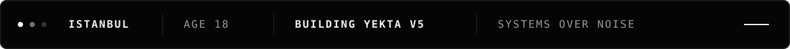
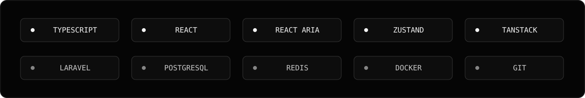

<div align="center">
  

  <br />

  <h1>BEDİRHAN YILMAZ</h1>

  <p>
    <code>SOFTWARE DEVELOPER</code>&nbsp;&nbsp;·&nbsp;&nbsp;
    <code>ISTANBUL / TR</code>&nbsp;&nbsp;·&nbsp;&nbsp;
    <code>18</code>
  </p>

  <sub>Building quiet systems for loud problems.</sub>
</div>

<br />



## 01 / IDENTITY

I am an 18-year-old software developer based in **Istanbul, Türkiye**. I care about the part of software that survives after the first demo: clear architecture, deliberate interfaces, strong authorization and systems that remain understandable as they grow.

```ts
const bedirhan = {
  location: "Istanbul, Türkiye",
  age: 18,
  building: "Yekta v5",
  focus: [
    "Frontend Architecture",
    "Accessible Design Systems",
    "Multi-tenant SaaS",
    "API & Product Engineering",
  ],
  standard: "type-safe · accessible · maintainable",
} as const;
```


## 02 / CURRENT MISSION

### Yekta v5

A modular, multi-tenant SaaS platform built for real business operations — ERP, MES and vertical products sharing one reliable core.

- Designing a frontend architecture that can grow for years
- Building accessible, reusable product primitives instead of page-specific UI
- Separating server state, client state and form state cleanly
- Treating authentication, authorization and tenant isolation as backend guarantees
- Turning dense operational workflows into calm, usable interfaces


## 03 / ENGINEERING FOCUS

| Field | What I work on |
| :--- | :--- |
| **Frontend Architecture** | Feature boundaries, design systems, state strategy, forms, data-heavy interfaces |
| **Accessible UI** | Keyboard-first interaction, semantic components, predictable behavior, React Aria |
| **Product Systems** | ERP / MES / SaaS workflows, multi-tenancy, role-based experiences |
| **Backend & Data** | Laravel APIs, PostgreSQL, Redis, queues, authentication and authorization |
| **UI / UX Engineering** | Responsive admin panels, information hierarchy, ergonomic operational screens |


## 04 / TOOLKIT

<div align="center">
  
</div>

<br />

`TypeScript` · `React` · `React Aria` · `Zustand` · `TanStack Query` · `Zod` · `Laravel` · `PostgreSQL` · `Redis` · `Docker` · `Git`


## 05 / BUILD PRINCIPLES

```text
01  Accessibility is infrastructure, not polish.
02  State should live where it actually belongs.
03  Authorization is enforced on the server.
04  Boring, explicit code ages better than clever code.
05  A design system is a product contract, not a component folder.
06  Performance begins with architecture, not last-minute optimization.
```

<br />

> Gürültüyü değil, sistemi büyüt.

<div align="center">
  <br />
  
  <br /><br />
  <sub>ISTANBUL&nbsp;&nbsp;///&nbsp;&nbsp;BUILDING IN SILENCE&nbsp;&nbsp;///&nbsp;&nbsp;2026</sub>
</div>

