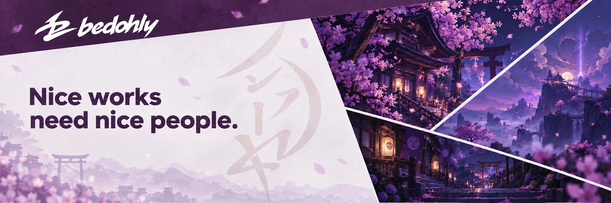
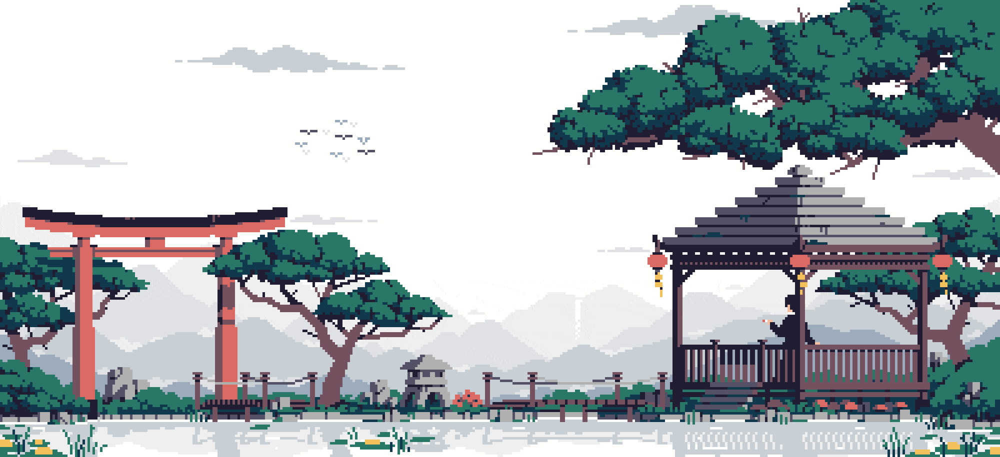

<!-- ====================================================== -->
<!--                         HEADER                         -->
<!-- ====================================================== -->

  

<!-- ====================================================== -->
<!--                     PROFILE STATS                      -->
<!-- ====================================================== -->

&nbsp;&nbsp;&nbsp;&nbsp;&nbsp;&nbsp;&nbsp;

 

<!-- ====================================================== -->
<!--                        ABOUT ME                        -->
<!-- ====================================================== -->

<!--
Buraya sıradaki aşamada:

SOL:
./assets/pixel-bedohly.png

SAĞ:
About Me
-->

<!-- ====================================================== -->
<!--                       TECH STACK                       -->
<!-- ====================================================== -->

<!-- ====================================================== -->
<!--                        PROJECTS                        -->
<!-- ====================================================== -->

<!-- ====================================================== -->
<!--                         FOOTER                         -->
<!-- ====================================================== -->

 

  

