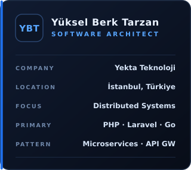

<!-- ====================================================== -->
<!--                         HEADER                         -->
<!-- ====================================================== -->

  

  
  &nbsp;
  
  &nbsp;&nbsp;&nbsp;
  
  &nbsp;
  

<!-- ====================================================== -->
<!--                        ABOUT ME                        -->
<!-- ====================================================== -->

  

I design and lead the systems behind the product: where the service boundaries fall, how the
data moves between them, and what the team can safely build on top. Most of my work lives in
the **PHP / Laravel** ecosystem, with **Go** where the throughput asks for it.

&#9656; &nbsp;**Service architecture** — boundaries, gateways, contracts that hold 
&#9656; &nbsp;**Platform foundations** — skeletons and shared packages to build on 
&#9656; &nbsp;**API design** — versioned, documented, predictable by default 
&#9656; &nbsp;**Data &amp; consistency** — clean schemas, tight queries, sane caching 
&#9656; &nbsp;**Identity &amp; access** — token flows, least privilege, no secrets in git 
&#9656; &nbsp;**Delivery** — containerised services, CI pipelines, boring releases 
&#9656; &nbsp;**Leading from the front** — the pack moves at the pace of the leader

 

  

<!-- ====================================================== -->
<!--                     SELECTED WORK                      -->
<!-- ====================================================== -->

  

  
  &nbsp;
  

  
  &nbsp;
  

<!-- ====================================================== -->
<!--                       TECH STACK                       -->
<!-- ====================================================== -->

  

<table align="center">
  <tr>
    <th align="left">Layer</th>
    <th align="left">Stack</th>
  </tr>
  <tr>
    <td><b>Languages</b></td>
    <td></td>
  </tr>
  <tr>
    <td><b>Frontend</b></td>
    <td></td>
  </tr>
  <tr>
    <td><b>Backend</b></td>
    <td></td>
  </tr>
  <tr>
    <td><b>Data</b></td>
    <td></td>
  </tr>
  <tr>
    <td><b>Cloud &amp; DevOps</b></td>
    <td></td>
  </tr>
  <tr>
    <td><b>Tooling</b></td>
    <td></td>
  </tr>
</table>

<!-- ====================================================== -->
<!--                      GITHUB STATS                      -->
<!-- ====================================================== -->

  

  
  &nbsp;
  

  

